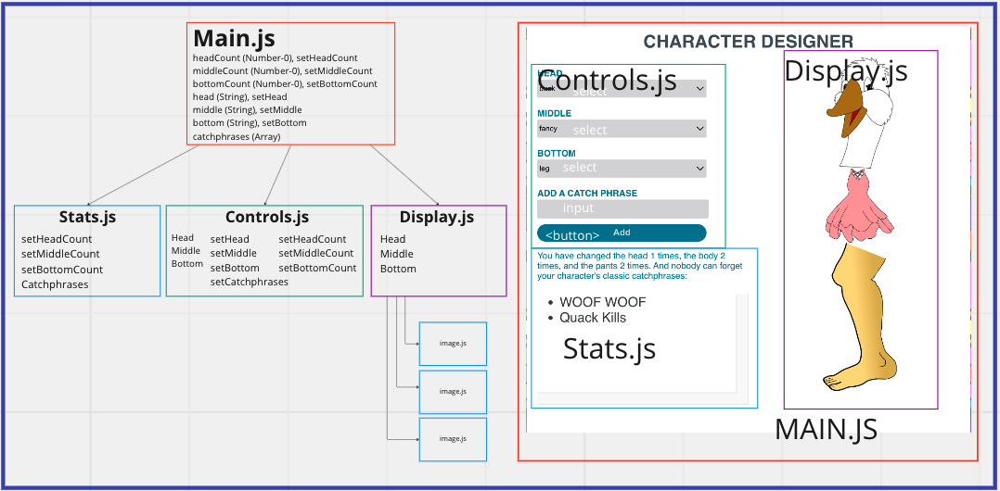

# From Scratch Planning

- Step 1 - Get head / head image display working (ignore count)
- Step 2 - Get middle / middle image display working (ignore count)
- Step 3 - Get bottom / bottom image display working (ignore count)
- Step 4 - Add Counts
- Step 5 - Add Catchphrases
